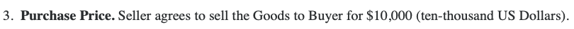
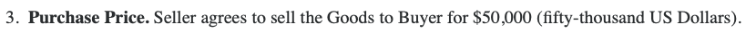

The CSS3 standard adds a number of features to the language, including [Media Queries](https://en.wikipedia.org/wiki/Media_queries), which allow designers to declare that content should be shown or styled differently depending on the medium it's presented on. The intended use case is e.g., to hide unnecessary images or backgrounds when printing, or to adjust the display style for mobile vs desktop browsers. Here, we use them to alter a contract's price when printed. Note that no JavaScript or other features commonly blocked by security-conscious users is necessary to do this.


# The Proof-of-Concept

All modern browsers support CSS Media queries, and [many](https://caniuse.com/#feat=css-mediaqueries) not-so modern ones do too. [This proof-of-concept](contract.html) should therefore work on nearly any browser. It is a stock sales contract that shows an on-screen price of $10,000:



...but changes the price to $50,000 when printed:



# Demo CSS

Some simple CSS allows us to mark elements to show on screen and hide in print, or vice-versa:

```css
@media not screen {
    .noprint {
        display: none;
    }
}

@media screen {
    .noscreen {
        display: none;
    }
}
```

With this stylesheet, we can then make a set of similar contract clauses; one will show on print, the other on screen:

```html
<div class="noprint">
    <strong>3. Purchase Price.</strong>&nbsp;Seller agrees to sell the Goods to Buyer for $10,000 (ten-thousand US Dollars).
</div>
<div class="noscreen">
    <strong>3. Purchase Price.</strong>&nbsp;Seller agrees to sell the Goods to Buyer for $50,000 (fifty-thousand US Dollars).
</div>
```

On screen, the `noscreen` clause will be hidden, while the `noprint` clause will not show in print. A user that reads the contract on screen and then prints and signs it will be signing a different contract than they intended to.