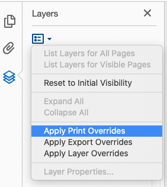
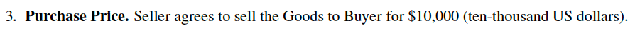
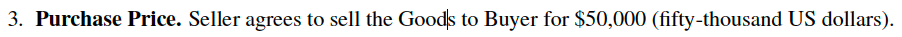

# "Misprinting" PDFs
Most people consider PDF to be the "gold standard" for representing documents in a way that will render identically between platforms and mediums --- it's called the *Portable* Document Format for a reason. However, PDF is also a standard that has many, many features that might break this expectation. PDF documents can contain Javascript, 3D models, fillable forms with logic, digital signature metadata, and a host of other information that won't show up in print. Most of those features are primarily supported by Adobe Reader, which will either require the user to [approve](https://helpx.adobe.com/acrobat/using/security-warnings-pdf-opens.html) loading the content or show extra UI elements to alert the user that the document is interactive in some way. 

Instead, we're going to use a little-known PDF feature called [Optional Content Groups](https://help.adobe.com/pdfl_sdk/15/PDFL_SDK_HTMLHelp/PDFL_SDK_HTMLHelp/API_References/PDFL_API_Reference/PD_Layer/PDOCG.html) (OCGs). OCGs are groups of PDF content objects such as text that can be configured to appear or disappear under a number of conditions, including whether or not the PDF is being displayed on a screen or printed. OCGs do not show any UI or warnings, and have wide support across renderers. the PoC PDF in this repository was tested to render correctly (that is to say, differently in print and on screen) on:

- Adobe Reader (Windows 10)
- Chrome (Windows 10)
- SumatraPDF (Windows 10). 
- Adobe Reader (MacOS Catalina)
- MS Edge (Blink based, Windows 10)

The PoC does not render correctly (that is, it prints the same as it renders) on:

- Preview (MacOS Catalina)
- Chrome (MacOS Catalna)
- Firefox (MacOS Catalina)
- Evince (Ubuntu 18.10)

In Acrobat Reader, you can force it to draw the document as if it was printed in the "Layers" sidebar by using the "Apply Print Overrides" option:



# The Proof-of-Concept

Our [Proof-of-Concept](contract.pdf) uses OCGs to show a different price when printed than on screen. The price renders on screen as $10,000:



And it renders in print as $50,000:



# Generating PDFs with OCGs

The easiest way to generate a PDF with OCGs is to use [LaTeX](https://www.latex-project.org) with the [`ocg-p` package](https://ctan.org/pkg/ocg-p?lang=en). By specifying `printocg=never` and setting the initial visibility to `1` (visible), you can insert arbitrary content into the PDF that will not show when printed. Setting `listintoolbar=never` instructs the PDF viewer to not show the OCG in the layers toolbar, which in documents with no other layers usually means no layer UI is shown at all. Inverting the first two options produces content that is invisible on screen and visible when printed. For example:

```latex
\begin{ocg}[printocg=never,listintoolbar=never]{Nonprinting Text}{nonprinting_text}{1}
    This text will appear on screen, but not in print.
\end{ocg}

\begin{ocg}[printocg=always,listintoolbar=never]{Nonprinting Text}{nonprinting_text}{1}
    This text will appear in print, but not on screen.
\end{ocg}
```

It's even possible to overlay text such that sentences, paragraphs, or even whole pages appear differently using OCGs. In LaTeX, this is accomplished using TikZ; the manual for the `ocg-p` package has an example of this, reproduced below:

```latex
The following text can be toggled: 
\begin{tikzpicture}[baseline=0]
\tikzstyle{nome}=[anchor=base,outer sep=0,inner sep=0,minimum height=.45cm,minimum width=4.4cm]
\begin{ocg}{blue text}{ocblueid}{1}
  \node[nome,blue]        (p1)  {\parbox[b][][t]{4.4cm}{This text is written in blue.}};
\end{ocg}
\begin{ocg}{red text}{ocredid}{0}
  \node[overlay,nome,red] (p2)  {\parbox[b][][t]{4.4cm}{This text is written in red.}};
\end{ocg}
\end{tikzpicture}
And now the text is black again.
```